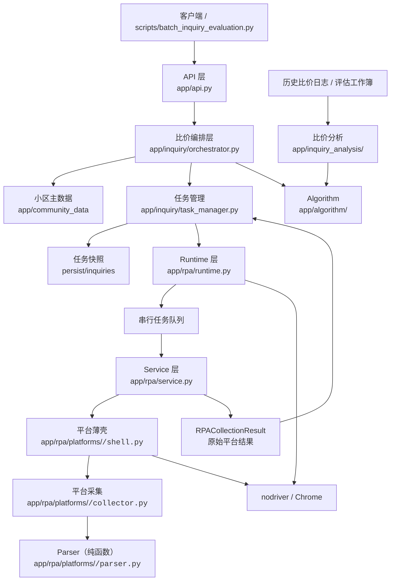
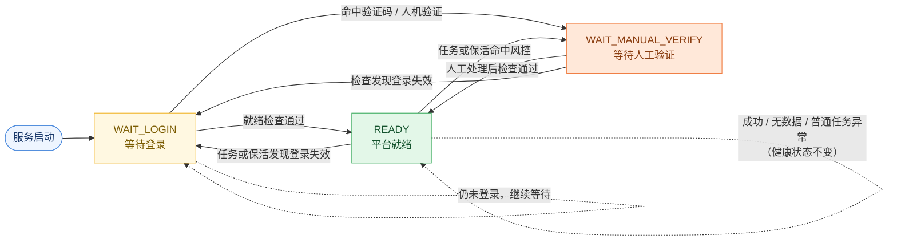
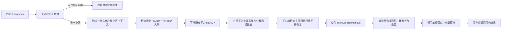

# ARCHITECTURE —— 系统架构与运行时状态

> 本文档面向维护者与 AI 协同开发：**改动代码前必读**。描述模块边界、运行时状态机、
> 并发与风控协议、比价链路与崩溃恢复。业务用法与运行方式见 [README](README.md)。

## 1. 系统架构概览

架构链路：API 层（`app/api.py`）→ 比价编排层（`app/inquiry/`）→ Runtime（`app/rpa/runtime.py`）
→ Service（`app/rpa/service.py`）→ 平台聚合目录（`app/rpa/platforms/<code>/{shell,collector,parser,constants}.py`）；
估价在 `app/algorithm/`，小区身份在 `app/community_data/`，结果入库在 `app/property_records/`。

### 1.1 目录说明

```text
jeethink-rpa/
├─ app/
│  ├─ algorithm/             # 估价算法（纯函数，无 IO）
│  │  ├─ models.py / config.py / area_rules.py / branch_text.py
│  │  ├─ selection.py / listing_dedup.py / deal_screening.py
│  │  └─ weighted_median.py  # 加权落点中位数（唯一注册算法）
│  ├─ community_data/        # 小区主数据（独立 SQLite；别名/期数/附近查询）
│  │  ├─ models.py / normalization.py / database.py / geocoder.py
│  │  └─ config.py / service.py
│  ├─ inquiry/               # 比价编排层（小区确认 / 任务快照 / 结果聚合）
│  │  ├─ models.py / orchestrator.py / task_manager.py / task_store.py
│  │  └─ aggregation.py / completion.py
│  ├─ inquiry_analysis/      # 历史日志离线分析与 Excel 导出
│  │  ├─ export_operation_log_excel.py / presentation.py
│  ├─ property_records/      # 房源成交/挂牌记录入库
│  │  ├─ models.py / normalization.py / database.py / ingestion.py
│  ├─ persistence/           # SQLite 连接/事务通用封装（SQL trace 日志）
│  │  └─ sqlite.py
│  ├─ rpa/
│  │  ├─ core/               # config.py / models.py / price_utils.py / status.py
│  │  ├─ platforms/          # base.py + city_map.py + <code>/{shell,collector,parser,constants}.py
│  │  ├─ utils/              # callback / dingtalk / logging_utils / debug_utils / mvp_result / window_control
│  │  ├─ registry.py / runtime.py / service.py
│  ├─ api.py                 # FastAPI 路由定义（create_app）
├─ scripts/
│  ├─ api_server.py               # 服务启动入口
│  ├─ batch_inquiry_evaluation.py # 批量比价客户端（模拟客户端）
│  ├─ collect_community_data/     # 小区数据抓取编排 + 五平台 MVP
│  ├─ community_data/             # 小区主数据初始化/维护脚本
│  └─ initialize_community_page/  # 平台入口初始化 + 入口发现 MVP
├─ tests/                    # 单元测试（14 个模块 / 49 个测试，全部离线）
├─ docs/                     # 专项文档
├─ sql/                      # 两库 schema 基线（应用启动时幂等执行）
├─ third_party/              # 第三方依赖源码
├─ example/                  # 比价清单示例（心理价格式，批量客户端默认输入）
├─ persist/ debug/ logs/ results/ test_data/
├─ requirements.txt
└─ README.md
```

## 2. 总体分层



### 各层职责

| 层 | 主要文件 | 职责 | 不负责的内容 |
|---|---|---|---|
| API | `app/api.py` | 接收请求、健康检查、状态查询、参数管理 | 浏览器操作、平台选择器 |
| 比价编排 | `app/inquiry/` | 查询小区、持有已确认小区上下文、处理未找到或多期结果、创建和弱持久化比价任务、崩溃恢复；接收原始结果并调用算法。热数据短路在此层：48h 窗口内更新过数据的小区×平台（≥3 个平台才激活）跳过 RPA，用库内数据合成结果并跳过重复落库 | 浏览器与平台采集、房源入库 |
| Runtime | `app/rpa/runtime.py` | 浏览器生命周期、平台会话、状态机、进程内任务队列、保活；将原始结果交给注入的完成处理器并通知任务终态 | 比价任务弱持久化、崩溃恢复、页面 DOM 解析、价格决策 |
| Service | `app/rpa/service.py` | 并行调度平台并返回原始 `RPACollectionResult` | 平台专属选择器、价格算法 |
| Platform | `app/rpa/platforms/` | 城市导航、平台流程委托、平台专属检测 | 修改核心算法 |
| Parser | `app/rpa/platforms/<code>/parser.py` | 从 HTML/结构化结果提取数据 | 浏览器控制、跨平台调度 |
| Algorithm | `app/algorithm/` | 房源去重、面积弱参考、价格峰和最终取值决策 | 网络 IO、平台风控 |
| 比价分析 | `app/inquiry_analysis/` | 读取历史比价日志和评估工作簿，按当前算法重建并导出分析 Excel | 浏览器运行时、平台采集、在线比价结果写入 |

## 3. 核心模块与运行时对象

**比价编排层 `app/inquiry/`**

- `orchestrator.py`：确认小区身份（未找到 / 类型不支持 / 多期需指定 / 唯一命中），
  构造 `ConfirmedCommunityContext`（含 `community_id`）。
- `task_manager.py`：为每次询价生成服务端 UUID `task_id`，客户端 `request_id` 仅作关联标识；
  快照写入成功后才向 Runtime 入队；入队失败删除快照；服务重启后
  等 RPA 就绪按创建时间恢复残留任务，恢复完成前拒绝新比价；任务终态删除快照。
- `task_store.py`：`persist/inquiries/{taskId}.json` 原子写入/加载/删除。
- `aggregation.py`：汇总所有 `SUCCESS` 平台原始数据（面积严格筛选 + 弱参考 + 跨平台
  去重 + 成交口径收敛），调用算法。
- `completion.py`：持有最终聚合，主链先返回；数据沉淀转后台线程执行，停服前
  `wait_background()` 兜底。

**Runtime `app/rpa/runtime.py`** 维护：

- 已注册平台的浏览器实例与 `PlatformSession`。
- 平台健康状态 `platform_states`、比价任务记录 `tasks`、串行队列 `queue`、当前任务。
- 保活、心跳、控制台人工确认三个后台协程；平台检查互斥锁 `_platform_check_lock`。
- 启动阶段任一浏览器或平台会话失败时回滚已创建资源，清空半启动状态并允许重试。
- GET 查询限流（`_last_get_at`）与结果回调推送（`CALLBACK_URL`）。

**Service `app/rpa/service.py`**：管理平台常驻会话；每次接收一个 `InquiryRequest`，
`asyncio.gather` 并行采集各平台，等所有平台协程结束且风险平台恢复后交付
`RPACollectionResult`。行政区随请求透传。

**Algorithm `app/algorithm/`**（纯函数，无网络 IO）：

- `weighted_median.py` — 加权落点中位数（唯一注册算法 `DEFAULT`）。
- `selection.py` — 严格面积选择、弱参考与同平台去重。
- `listing_dedup.py` — 跨平台保守去重。
- `deal_screening.py` — 成交记录按平台口径（面积容差 + 近半年）收敛，唯一口径来源。

**小区主数据与房源记录**：`app/community_data`（身份查询两个接口）、
`app/property_records`（采集结果入库与入口白名单），详见
[小区主数据与房源记录](docs/小区基础数据模块.md)。

**平台公共件 `app/rpa/platforms/base.py`**：

| 函数/机制 | 用途 |
|------|------|
| `wait_for_manual_unblock()` | 风控/登录拦截时等待人工处理 |
| `detect_common_block(url, html)` / `is_generic_captcha_page(html)` | 统一公共风控兜底检测 |
| `detect_block_with_common(detect_func, url, html)` | 平台专属规则优先，未命中叠加公共兜底 |
| `wait_and_reload_after_block(tab, detect_func, label, platform_code=...)` | 风控统一处理：检测→等人回车→重取，直到恢复；模块级检测函数显式传入平台代码 |
| `_human_click(page, element, label)` | 【回退】真人节奏点击（JS 优先），仅成交翻页按钮兜底路径使用 |
| `safe_select_and_click(page, selector, ...)` | 【回退】安全选择+点击：找不到元素时 dump + 风控检测 + 恢复后重试（lj 成交翻页兜底） |
| `community_name_match(request_name, captured_name)` | 结构化小区名匹配；双方带期数且不同时不匹配 |
| `has_matching_community_snapshots` / `filter_snapshots_by_community` / `prepare_listing_data` | 归属校验与同源过滤 |
| `human_linger(page, page_no)` | 【遗留】旧搜索式链路的翻页停留，现行链路无调用方 |
| `check_empty_listing_page(...)` | 【遗留】旧搜索式链路的翻页空页检测 |
| `click_area_segment(...)` | 【遗留】旧搜索式链路的面积档位点击，URL 直达形态不再使用 |

**城市映射 `app/rpa/platforms/city_map.py`**：`CITY_MAP[code][city] = url_prefix`
显式登记（命名规则不统一，不能推导）；`get_start_url` / `is_city_supported` /
`get_city_prefix`。

**`app/rpa/utils/`**：`callback.py` 结果回调推送（带重试）、`dingtalk.py` 钉钉通知、
`logging_utils.py` 按日切分日志、`debug_utils.py` 调试 HTML 导出（`debug/`）、
`mvp_result.py` MVP 结果统一输出、`window_control.py` 窗口枚举/置前/平铺（Win32）。

## 4. 运行时状态机

状态分为四类，不能混用：

| 状态类别 | 定义位置 | 作用 |
|---|---|---|
| 服务状态 `ServiceStatus` | `app/rpa/core/status.py` | 整个 RPA 服务能否接收任务 |
| 平台健康状态 `PlatformHealthStatus` | 同上 | 某个平台当前能否继续采集 |
| 平台结果状态 `PlatformResultStatus` | 同上 | 某次任务在某个平台的采集结果 |
| 任务状态 `TaskStatus` | 同上 | 某个比价任务的生命周期 |

```text
服务状态：    BOOTING 启动中 / WAIT_LOGIN 存在未登录平台 / READY 全部就绪
             / DEGRADED 存在人工验证或异常平台 / STOPPING 停止中
平台健康：    INIT / WAIT_LOGIN / READY / WAIT_MANUAL_VERIFY / ERROR
平台结果：    SUCCESS / NO_DATA / NO_MATCHING_AREA / WAIT_MANUAL_VERIFY
             / LOGIN_EXPIRED / ERROR
任务状态：    QUEUED / RUNNING / COMPLETED / FAILED
```

平台健康状态是服务是否可以继续工作的依据。普通任务 `ERROR` 不应直接覆盖平台健康状态。

### 状态转换



> 实线 = 平台健康状态发生变化（`PlatformHealthEvent` 驱动，`transition_platform_health`
> 是唯一入口）；虚线自环 = 本次结果只记录任务结果，健康状态保持不变
> （`SUCCESS` / `NO_DATA` / `NO_MATCHING_AREA` / 普通 `ERROR`）。

`PlatformHealthEvent` 是状态转换的唯一入口（`transition_platform_health`），
Runtime 不应在业务代码中随意直接赋值改变状态。结果状态中只有
`LOGIN_EXPIRED`（→ `WAIT_LOGIN`）与 `WAIT_MANUAL_VERIFY`（→ `WAIT_MANUAL_VERIFY`）
允许回写平台健康状态；`SUCCESS`/`NO_DATA`/`NO_MATCHING_AREA`/普通 `ERROR` 只记录本次结果。

## 5. 并发与风控协议

### 5.1 平台检查互斥

`_platform_check_lock` 统一保护：API/控制台触发的 `confirm_platform_ready()`、控制台
批量人工确认、定时保活的状态检查与回写、采集期间命中风控后的人工回车确认。

`_manual_confirmation_active` 标记存在时保活循环跳过本轮，防止"保活先把平台改成
READY，人工确认随后跳过平台"的竞态。人工确认期间保留浏览器现场，等待人工处理。

汇总前，Runtime 在同一把锁内读取各平台常驻主标签页的 URL/HTML（不扫描延迟关闭的
详情/成交旧标签页），发现风控进入统一人工确认与页面恢复流程。

### 5.2 任务结果版本保护

任务开始时记录每个平台的 `version`。回写结果时：

1. 任务期间平台状态未变化：明确的 `LOGIN_EXPIRED` / `WAIT_MANUAL_VERIFY` 可更新健康状态。
2. 任务期间已发生人工确认、保活或其他状态变化：旧任务结果不得覆盖新状态。
3. 普通采集异常只写入任务结果，不把服务整体降级。

### 5.3 任务执行顺序

- 比价任务进入 `asyncio.Queue`，Worker 串行消费；单个任务内各平台并行采集。
- Worker 等待所有平台 `READY` 后才开始一次比价。
- 平台内部遵守既定 URL 直达、翻页与解析顺序。

### 5.4 风控职责边界

```text
平台 collector.detect_block
  └─ 平台专属 URL、HTML、登录态和验证码规则

app/rpa/platforms/base.py
  └─ 公共 URL/HTML 风控兜底（captcha 标识 + 通用验证码页判定）及统一恢复入口
```

- `detect_block_with_common()` 先执行平台专属检测，未命中时执行公共检测；
- `wait_and_reload_after_block()` 统一负责等待人工处理和重新取页面；
- 平台专属规则不能为复用上提公共层，公共规则不在平台目录重复维护；
- 登录失效注意两种形态：硬失效（跳登录 URL）与软失效（URL 不变、正文出现登录墙，
  如 fang 的登录墙标记、贝壳/链家的 `ucid:''` 判据）。

> **注意事项（fang 软风控）**：房天下存在"页面可访问、无验证码，但内容迟迟不渲染"
> 的软风控（实测正常 3~8s、停滞 60~116s）。打开挂牌页后超过
> `FANG_SOFT_BLOCK_SECONDS`（45s，`fang/constants.py`）内容未渲染：回首页刷新会话
> 再直达一次；仍超时按 `ERROR` 返回（reason 注明"软风控"），交人工处理。浏览器重开
> 升级属 Runtime 职责，不在 collector 内。

## 6. 比价链路与崩溃恢复

### 6.1 比价链路



采集期间命中验证码或登录失效时：

1. 采集中的平台在统一风控入口等待人工回车，其他平台继续采集。
2. Runtime 即时更新对应平台健康状态；页面恢复后该平台继续当前采集步骤。
3. 所有平台采集完成后，汇总前再次检查常驻主页面，风险未恢复则继续等待。
4. 所有风险平台恢复后才汇总并返回当前比价结果。

### 6.2 崩溃恢复与弱持久化

**任务持久化**（只有编排层读写，RPA 不接触快照文件）：

- 只有编排层确认唯一小区后才写 `persist/inquiries/{taskId}.json`；`task_id` 由服务端生成 UUID，
  客户端 `request_id` 只作为关联标识保留；快照包含
  `task_id`、`community_id`、创建时间、`InquiryRequest` 与完整
  `ConfirmedCommunityContext`，两处 `community_id` 必须一致（原子写入）。
- 快照写入成功后才将不含 `community_id` 的采集请求交给 RPA；入队失败删除快照。
- 任务终态（成功/失败）由 RPA 通知编排层删除快照；停止取消中的任务保留快照。
- 进程崩溃重启后，编排层在 RPA 全部就绪后按创建时间恢复；恢复入队完成前
  `/health/ready` 与新比价均保持未就绪，避免新任务插队。旧的 `persist/{taskId}.json` 不参与。

**算法参数持久化**：`weightedMedianDiscount` 更新时同步写 `persist/runtime.json`，
启动自动读取（默认 0.9）。弱持久化：仅保证重启不丢失。

```text
persist/
├── runtime.json          # 算法参数（常驻）
├── inquiries/{taskId}.json   # 完整比价快照（编排层写入与删除）
├── community_data.sqlite3    # 小区主数据
└── property_records.sqlite3  # 房源记录（挂牌/成交/入口）
```
