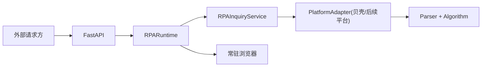

# jeethink-rpa

面向房产询价场景的 RPA 服务工程。当前已接入贝壳二手房平台，整体按“多平台可扩展”思路设计，后续可以继续接入链家、安居客、房天下、乐有家等平台。

项目目标不是一次性脚本，而是一套可长期驻留、可人工介入、可接收外部询价请求的 RPA 工程。

## 目录索引

- [1. 项目定位](#1-项目定位)
- [2. 当前业务链路](#2-当前业务链路)
- [3. 业务取值规则](#3-业务取值规则)
- [4. 架构分层](#4-架构分层)
- [5. 目录说明](#5-目录说明)
- [6. 核心模块说明](#6-核心模块说明)
- [7. 配置与常量边界](#7-配置与常量边界)
- [8. 启动流程](#8-启动流程)
- [9. 运行方式](#9-运行方式)
- [10. API 约定](#10-api-约定)
- [11. 日志与调试](#11-日志与调试)
- [12. 当前约束](#12-当前约束)
- [13. 后续扩展建议](#13-后续扩展建议)

## 1. 项目定位

当前版本重点解决以下问题：

- 浏览器常驻，不为每次询价重新冷启动。
- 由人工先完成登录，确认就绪后才允许接单。
- 后台接收询价请求，并串行执行采集流程。
- 平台被风控或登录失效时，服务状态可明确降级。
- 调试模式下可导出关键 HTML，方便定位页面结构变化。
- 日志按自然日切分，适合 7x24 值守机运行。

当前只接入了贝壳平台，但核心结构已经为多平台预留。

## 2. 当前业务链路

贝壳平台当前主流程如下：

1. 启动浏览器并打开二手房首页。
2. 人工在前台完成人机登录。
3. 回到终端按回车，确认平台 `READY`。
4. 接收询价请求：`communityName`、`areaMin`、`areaMax`。
5. 刷新常驻页面，执行轻量保活。
6. 先搜索目标小区。
7. 再在结果页点击面积档位。
8. 抓取主结果区在售单价，过滤广告和猜你喜欢。
9. 如存在分页，按真实点击页码方式翻页并采集。
10. 点击“小区详情”。
11. 抓取小区参考均价和成交案例。
12. 对成交案例按面积做筛选后计算成交均价。
13. 按业务规则计算最终单价。
14. 返回结果。
15. 详情页后台停留一段时间后自动关闭，主页面回到首页待命。

当前核心返回字段：

```json
{
  "quoteAvg": 85635.00,
  "dealAvg": 71086.50,
  "finalPrice": 71086.50
}
```

## 3. 业务取值规则

### 在售均价

- 从抓到的在售单价列表中取平均值。

### 成交均价

- 先对成交案例按面积做筛选。
- 筛选规则为：落在请求面积上下浮动 `20%` 以内的数据才保留。
- 对筛选后的成交单价取平均值。

### 最终取值

- 若 `quoteAvg` 和 `dealAvg` 都存在：
- 先计算差值比例：`|quoteAvg - dealAvg| / dealAvg`
- 若差值比例 `<= 10%`，取较低值。
- 若差值比例 `> 10%`，只取 `dealAvg`。
- 若没有 `dealAvg`，取 `quoteAvg * 0.9`。
- 若没有 `quoteAvg` 但有 `dealAvg`，直接取 `dealAvg`。

对应代码位置：

- `app/parsers.py`
- `app/algorithm.py`
- `app/service.py`

## 4. 架构分层

整体分为 5 层：

1. `API 层`
   接收 HTTP 请求，对外暴露健康检查、状态查询、询价接口。
2. `Runtime 层`
   管理浏览器实例、平台会话、任务队列、服务状态、保活流程。
3. `Service 层`
   负责调度多个平台适配器，汇总平台结果并计算最终报价。
4. `Platform Adapter 层`
   每个平台一个适配器，统一实现打开会话、检查就绪、保活、执行采集。
5. `Parser / Algorithm 层`
   负责页面解析和纯算法决策，不承担浏览器控制。

简化关系如下：



## 5. 目录说明

```text
jeethink-rpa/
├─ app/
│  ├─ api.py
│  ├─ runtime.py
│  ├─ service.py
│  ├─ registry.py
│  ├─ models.py
│  ├─ algorithm.py
│  ├─ parsers.py
│  ├─ ke_adapter.py
│  ├─ price_utils.py
│  ├─ logging_utils.py
│  ├─ debug_utils.py
│  ├─ window_control.py
│  ├─ platforms/
│  │  ├─ base.py
│  │  ├─ ke.py
│  │  └─ ke_constants.py
│  └─ scripts/
│     ├─ api_server.py
│     ├─ mvp_test.py
│     ├─ batch_mvp_test.py
│     ├─ quote_detail_test.py
│     ├─ combined_flow_test.py
│     ├─ more_options_test.py
│     └─ search_flow_test.py
├─ tests/
├─ debug/
├─ logs/
├─ config.py
├─ requirements.txt
└─ README.md
```

## 6. 核心模块说明

### `app/api.py`

FastAPI 入口。

当前主要接口：

- `GET /health/live`
- `GET /health/ready`
- `GET /admin/status`
- `POST /admin/platforms/{code}/confirm-ready`
- `POST /inquiries`
- `GET /inquiries/{taskId}`

### `app/runtime.py`

服务运行时核心。

职责：

- 启动常驻浏览器。
- 打开各平台常驻页面。
- 维护平台状态。
- 管理任务队列。
- 串行执行询价任务。
- 定时保活。
- 需要人工处理时尝试将浏览器置前。

### `app/service.py`

平台调度与结果汇总层。

职责：

- 调用一个或多个平台适配器执行询价。
- 汇总平台结果。
- 记录采集日志。
- 生成最终 `InquiryResult`。

当前结果选择策略：

- 优先取第一个 `SUCCESS` 平台结果。
- 若没有成功结果，则退化使用第一个非 `ERROR` 结果。

### `app/platforms/base.py`

平台适配器抽象基类。

每个平台必须实现：

- `open_session`
- `collect`
- `check_ready`
- `keepalive`

### `app/platforms/ke.py`

贝壳平台适配器，负责将贝壳接入统一抽象。

### `app/platforms/ke_constants.py`

贝壳平台固有常量。

例如：

- 首页 URL
- 面积档位映射

### `app/ke_adapter.py`

贝壳真实采集逻辑主体。

职责：

- 搜索框交互
- 面积筛选点击
- 分页点击
- 在售单价抓取
- 小区详情点击
- 成交案例抓取
- 登录和验证状态探测

### `app/parsers.py`

页面内容解析器。

负责把 HTML 解析成结构化数据，例如：

- 在售房源单价
- 房源摘要
- 小区详情链接
- 小区均价
- 成交记录

### `app/algorithm.py`

最终单价决策算法。

### `app/price_utils.py`

价格格式化与两位小数处理工具。

### `app/logging_utils.py`

日志配置。

特点：

- 同时输出控制台和文件。
- 日志文件按自然日切换。
- 文件名格式为 `logs/YYYYMMDD-info.log`。

### `app/debug_utils.py`

RPA 调试辅助。

特点：

- 默认不导出 HTML。
- 仅在调试模式开启时导出到 `debug/`。
- 调试模式可通过 `--debug` 或环境变量 `RPA_DEBUG=1` 开启。

### `app/window_control.py`

Windows 浏览器置前控制。

当前用于：

- 服务启动后提示人工登录。
- 登录失效或命中人机验证时提示人工介入。

## 7. 配置与常量边界

### `config.py`

只放“运行时可能调整”的配置：

- 浏览器路径
- API 监听地址
- 调试开关
- 保活间隔
- 详情页停留时间
- 算法参数

当前与取值规则相关的关键配置：

- `DEAL_DIFF_THRESHOLD = 0.10`
- `NO_DEAL_DISCOUNT = 0.9`

### 平台常量文件

放“平台固有定义”，例如贝壳的：

- 起始 URL
- 面积档位编码

这样做的原因：

- 部署配置和平台规则职责分离。
- 避免把不该改的内容暴露成配置项。
- 后续接入第二个平台时更容易按平台目录归档。

## 8. 启动流程

服务启动流程：

1. 启动浏览器。
2. 打开平台常驻页面。
3. 浏览器置前，等待人工登录。
4. 人工完成登录后回到终端按回车。
5. 平台执行 `ready` 检查。
6. 全部平台就绪后，服务状态切换为 `READY`。
7. 这时才允许 `/inquiries` 接单。

如果未就绪时收到询价请求，服务会返回 `503 SERVICE_NOT_READY`。

## 9. 运行方式

### 安装依赖

```bash
pip install -r requirements.txt
```

### 启动服务

```bash
python -m app.scripts.api_server
```

调试模式：

```bash
python -m app.scripts.api_server --debug
```

### 单次演示脚本

```bash
python -m app.scripts.mvp_test
```

### 批量演示脚本

```bash
python -m app.scripts.batch_mvp_test
```

自定义场景示例：

```bash
python -m app.scripts.batch_mvp_test --scenario "绿景虹湾,70,90" --scenario "半岛城邦花园一期,110,140"
```

### 详情链路测试脚本

```bash
python -m app.scripts.quote_detail_test --manual-login
```

## 10. API 约定

### 创建询价任务

`POST /inquiries`

请求体：

```json
{
  "communityName": "绿景虹湾",
  "areaMin": 70,
  "areaMax": 90,
  "requestId": "demo-001"
}
```

返回：

```json
{
  "code": "ACCEPTED",
  "message": "询价任务已受理",
  "data": {
    "taskId": "demo-001",
    "status": "排队中",
    "statusCode": "QUEUED"
  }
}
```

### 查询询价结果

`GET /inquiries/{taskId}`

完成后返回的 `data` 核心结构：

```json
{
  "quoteAvg": 85635.00,
  "dealAvg": 71086.50,
  "finalPrice": 71086.50
}
```

字段说明：

- `quoteAvg`：在售均价。基于抓到的在售单价列表计算得到的平均值，单位为 `元/平`。
- `dealAvg`：成交均价。基于成交案例先做面积 `20%` 范围筛选，再对筛选后的成交单价取平均值，单位为 `元/平`。
- `finalPrice`：最终取值。按业务规则对 `quoteAvg` 和 `dealAvg` 进行决策后的最终建议单价，单位为 `元/平`。

说明：

- 文档示例按两位小数展示，便于阅读。
- 实际接口返回为 JSON number，像 `71086.50` 在部分序列化场景下可能显示为 `71086.5`，数值含义不变。

### 服务未就绪

当平台还未人工登录确认时：

```json
{
  "code": "SERVICE_NOT_READY",
  "message": "RPA 服务尚未就绪",
  "data": {
    "serviceStatusCode": "WAIT_LOGIN",
    "serviceStatus": "等待登录"
  }
}
```

## 11. 日志与调试

### 日志

日志输出到：

- 控制台
- `logs/YYYYMMDD-info.log`

日志内容重点包括：

- 查询小区与面积范围
- 平台抓到的房源摘要
- 在售均价
- 成交均价
- 最终取值
- 异常和风控信息

### 调试 HTML

开启调试模式后，会把关键页面导出到：

- `debug/*.html`

主要用于：

- 定位页面结构变化
- 分析点击失败
- 排查风控跳转
- 分析分页 DOM

## 12. 当前约束

当前版本有以下明确边界：

- 运行环境以 Windows 值守机为前提。
- 浏览器使用 Edge。
- 平台需要人工前置登录。
- 命中平台人机验证时，仍需要人工介入。
- 当前仅实现单浏览器、单任务串行执行。
- 当前仅接入贝壳平台。

这些约束是有意为之，优先保证稳定可用，而不是过早做复杂并发或多浏览器编排。

## 13. 后续扩展建议

当第二个平台接入时，建议沿用现有结构：

1. 在 `app/platforms/` 下新增平台适配器与平台常量。
2. 在 `app/registry.py` 注册新平台。
3. 复用 `runtime/service/models/api`，不改外部协议。
4. 各平台内部自行处理搜索、筛选、详情、风控逻辑。

这样可以保证“新增平台”是增量开发，而不是重搭框架。
