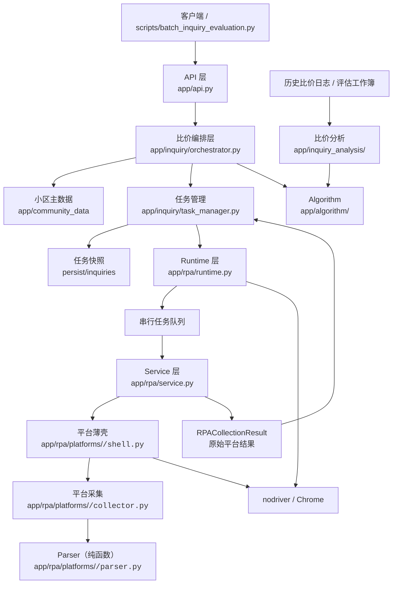
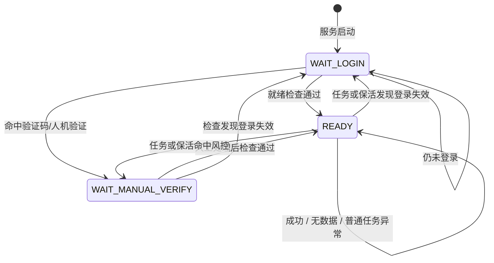
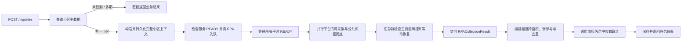

# jeethink-rpa —— 二手房找房比价服务

> 你想买二手房：给出你的**目标价**（心理价），系统按小区采集真实在售与成交房源，
> 逐条比对后给出市场**参考单价**与目标价偏差，辅助买房决策。
> 基于 FastAPI + nodriver 的多平台二手房找房比价服务：浏览器常驻、人工登录确认、
> 串行比价任务、多平台并行采集、加权落点中位数估价。
> 重构后 RPA 层只负责抓取；任务编排、小区身份、估价与数据沉淀分别在
> `app/inquiry/`、`app/algorithm/`、`app/property_records/`。

专项文档：[平台扩展对接](docs/平台扩展对接文档.md) ·
[API 接口详情](docs/API接口文档.md) ·
[小区主数据与房源记录](docs/小区基础数据模块.md) ·
[房源记录模块](docs/房源记录模块.md) ·
[AGENTS 编码约束](AGENTS.md)

## 目录

- [1. 项目定位与特性](#1-项目定位与特性)
- [2. 已接入平台及差异](#2-已接入平台及差异)
- [3. 快速开始](#3-快速开始)
- [4. 业务链路与取值规则](#4-业务链路与取值规则)
- [5. 系统架构](#5-系统架构)
- [6. 运行时状态机](#6-运行时状态机)
- [7. 并发与风控协议](#7-并发与风控协议)
- [8. 比价链路与崩溃恢复](#8-比价链路与崩溃恢复)
- [9. API 约定](#9-api-约定)
- [10. 日志、调试与排错](#10-日志调试与排错)
- [11. 多城市支持](#11-多城市支持)
- [12. 当前约束](#12-当前约束)

## 1. 项目定位与特性

当前版本重点解决以下问题：

- 浏览器常驻，不为每次比价重新冷启动。
- 由人工先完成登录，确认就绪后才允许接单。
- 后台接收比价请求，并串行执行采集流程。
- 支持**多城市比价**：API 入参含 `city`（城市名），各平台按城市映射表导航到对应城市首页后再采集。
- 采集完成后主动 POST 回调通知客户端（客户端无需轮询）；GET 查询保留作兜底并受限流。
- 平台被风控或登录失效时，服务状态可明确降级。
- 调试模式下可导出关键 HTML，方便定位页面结构变化。
- 日志按自然日切分，适合 7x24 值守机运行。
- 编排层在确认 `community_id` 后弱持久化完整比价任务，进程崩溃后重启自动恢复未完成任务。
- 算法参数（无成交折扣）支持运行时动态更新，弱持久化重启不丢失。

## 2. 已接入平台及差异

| 平台 | code | 采集内容 | 翻页方式 | 成交记录 | 小区均价 | 广东城市覆盖 |
|------|------|---------|---------|---------|---------|-------------|
| 贝壳 | ke | 在售快照 | URL 直达翻页 | 无 | 无 | 12/21 |
| 安居客 | ajk | 在售快照 | URL 直达翻页 | 无 | 列表页社区卡片 | 21/21 |
| 链家 | lj | 在售 + 成交明细 | URL 直达翻页 | 成交页 URL 直达 | 无 | 10/21 |
| 房天下 | fang | 在售 + 成交明细 | URL 直达翻页 | 成交页 URL 直达 | 无 | 21/21 |
| 乐有家 | lyj | 在售快照 | URL 直达翻页 | 无 | 列表页信息卡 | 9/21 |

5 个网页平台全部覆盖的城市（9 个）：广州、深圳、珠海、佛山、东莞、中山、惠州、江门、清远。

### 平台差异说明

- **采集形态**：全部平台为"URL 白名单直达 + HTML 解析"，无搜索、无点击、无模拟人机交互；翻页为分页 URL 直达。
- **面积口径**：RPA 不做页面面积筛选，请求面积由算法层用于在售严格筛选/弱参考（`selection.py`）与成交收敛（`deal_screening.py`）。
- **小区归属**：所有平台直达挂牌页后先校验目标小区归属；分页平台逐页过滤，只累计目标小区房源。第 1 页非空但全部无关时返回 `NO_DATA`，第 2 页起非空但全部无关时立即停止后续翻页并保留此前有效数据；返回前再次校验，确保房源明细与在售价格来自同一批数据。
- **安居客**：在售列表 URL 直达（含分页 URL），挂牌均价取自列表页社区卡片，仅作溯源。
- **乐有家**：同安居客，小区均价取自结果页信息卡，仅作溯源。
- **链家 / 房天下**：成交页 URL 直达（白名单 `deal_page_url`），成交明细交算法层按平台口径收敛（面积容差 + 近半年）。

## 3. 快速开始

### 3.1 安装依赖

```bash
pip install -r requirements.txt
```

### 3.2 启动服务

必须用 `-m` 模块方式、在项目根目录执行（脚本 import 的是 `app.*` 包）：

```bash
python -m scripts.api_server --debug --manual-login
```

| 参数 | 作用 |
|---|---|
| `--debug`（兼容旧名 `--excel`） | 开启 RPA 调试模式，导出关键页面 HTML 到 `debug/` 目录 |
| `--manual-login` | 平台未就绪时在终端提示回车，人工完成登录后按回车继续。首次/登录失效时建议带上 |
| `--no-recovery` | 测试模式：启动时清空 `persist/inquiries` 残留快照并跳过崩溃恢复（正式值守不要加） |
| `--port` | API 监听端口，默认 8000；启动前先探测端口占用，被占直接报错退出（避免半启动） |

启动过程：为每个已注册平台拉起独立常驻 Chrome → 打开各平台常驻页（初始 `WAIT_LOGIN`）→
终端提示人工登录 → 回车后批量确认各平台就绪 → 全部 `READY` 后编排层恢复崩溃前残留快照
→ 恢复入队完成后开始接单。未就绪时收到比价请求返回 `503 SERVICE_NOT_READY`。

带 `--manual-login` 时一次回车对应一个完整确认批次；确认与保活互斥，不会出现
"保活抢先改状态、确认跳过平台"的竞态。

### 3.3 就绪确认

```bash
curl http://127.0.0.1:8000/health/live     # 200=进程存活
curl http://127.0.0.1:8000/health/ready    # 200=所有平台就绪且比价恢复完成；503=未就绪（data 带快照）
curl http://127.0.0.1:8000/admin/status    # 详细快照：serviceStatusCode、各平台 statusCode/message、currentTaskId
curl -X POST http://127.0.0.1:8000/admin/platforms/ke/confirm-ready   # 人工确认某平台就绪
```

### 3.4 单平台 MVP 测试

各平台 MVP 已瘦身为工程薄调用（采集主流程与工程完全同源），用于单平台核对：

```bash
python -m scripts.collect_community_data.rpa.ke_mvp_test --community-id 170 --debug
```

### 3.5 批量比价客户端（模拟客户端）

`scripts/batch_inquiry_evaluation.py` 是纯 HTTP 客户端：读评估表，逐条
`POST /inquiries` 并轮询 `GET /inquiries/{taskId}`，最后写对比 Excel。
**必须等 `/health/ready` 返回 200 后再跑**：

```bash
# 冒烟：只跑评估表前 1 条
python -m scripts.batch_inquiry_evaluation --limit 1

# 小批量（输入表可用 --input 换，默认 test_data/房产评估汇总表_仅广州.xlsx）
python -m scripts.batch_inquiry_evaluation --limit 5
```

- 两种模式：表含 `评估单价` 列（即你的**目标价**/心理价）→ 比价偏差分析
  （`results/评估对比_*.xlsx`）；无该列 → 纯批量比价（`results/分析_*.xlsx`）。
- 必需列：`行政区`、`小区名称`、`面积㎡`；可选：`评估单价`（目标价）、`city`（逐行优先于 `--city`）。
- 运行中现象属正常：偶发 429（客户端 6s 轮询 vs 服务端 10s 限流，脚本自动处理）；
  命中验证码/登录时客户端阻塞等待，人工在服务端浏览器处理后回车，客户端自动重试当前条。

## 4. 业务链路与取值规则

### 4.1 通用主流程

各平台按差异微调，主流程：

1. 启动浏览器并打开各平台二手房首页。
2. 人工在前台完成各平台登录。
3. 通过 API `POST /admin/platforms/{code}/confirm-ready` 或终端回车确认就绪。
4. 接收比价请求：`city`、`administrativeDistrict`、`communityName`、`area`。
5. 比价编排层查询人工维护的小区主数据：未找到/非住宅/多期直接返回；只有唯一小区才创建 RPA 任务，并以小区正式名继续采集。
6. 检查各平台是否支持该城市：不支持的平台跳过比价只做保活刷新。
7. 城市导航：浏览器不在目标城市域名下时先导航到目标城市首页。
8. 刷新常驻页面，执行轻量保活。
9. 按白名单 URL 直达小区挂牌页，解析后校验快照与目标小区归属（不符整页弃用）。
10. 抓取主结果区，过滤推荐/广告区块，并立即按目标小区过滤房源快照。
11. 如有分页，按页 URL 直达累加：第 1 页非空但全部无关返回 `NO_DATA`；第 2 页起整页无关立即停止，混合页只保留匹配快照；空页走独立空页检测。
12. 返回平台结果前再次过滤，并从同一批快照生成 `listing_snapshots` 与 `quote_prices`。
13. 如平台有成交页，独立直达采集全量真实成交。
14. 成交案例按算法层口径（面积容差 + 近半年）筛选后计算成交均价。
15. 按业务规则计算最终单价。
16. 返回结果，页面回到待命状态。

> 如果所有平台都不支持该城市，直接返回 `NO_DATA`，note 为"不支持该城市"。

核心返回字段：

```json
{ "quoteAvg": 85635.00, "dealAvg": 71086.50, "finalPrice": 71086.50 }
```

### 4.2 成交均价口径

- **贝壳**：成交按请求面积 ±5㎡ 筛选（日期不筛）。
- **链家 / 房天下**：严格面积区间 ±5㎡ + 近半年（6 个月）。
- **安居客 / 乐有家**：无成交明细，平台挂牌均价仅作溯源，不参与成交平均。

各平台口径统一收敛在 `app/algorithm/deal_screening.py` 的 `DEAL_SCREENING_RULES`。

### 4.3 最终取值：加权落点中位数

代码位置：`app/algorithm/weighted_median.py:WeightedMedianAlgorithm`。系统固定使用这一套算法。

- 每个平台总权重相等，平台内每条有效在售价格按数量分配权重。
- 以相对中位数 ±10% 识别密集价格峰；只有无法与其他报价组成价格簇的单点才作为孤立噪声排除。
- 多个已成簇的价格带都保留为候选，即使它们与最高频峰的出现次数差距较大。
- 同一平台内先按稳定房源编号或完整字段去重；跨平台不比较标题，小区全称/无歧义简称、面积、单价、总价必须精确一致（双方均有户型时户型也必须一致）。
- **单峰**：`final_price = quote_avg × weightedMedianDiscount`，分支 `WEIGHTED_MEDIAN`。
- **多峰**：取最低价格峰中位数直接返回，不打折，分支 `WEIGHTED_MEDIAN_MULTI`；`candidates` 保留全部峰值供审计。
- **存在真实目标面积成交价**：挂牌峰值不打折，与成交价等权平均，分支 `WEIGHTED_MEDIAN_COMBINED`（豪宅段按支撑数/价差规则合并）。均价顶替值不参与。
- 50/50 双峰且无法形成明确主要区间时，不人为计算两个区间之间的中间价。
- 面积弱参考：严格 ±1㎡ 无可用价格峰时，最多放宽 `RPA_WEAK_AREA_MAX_TOLERANCE`（默认 ±20㎡）扩展候选，结果带 `WEAK_AREA_REFERENCE` 说明字段。
- 折扣 `weightedMedianDiscount` 默认 0.9，可通过 API 动态调整并弱持久化。

## 5. 系统架构

### 5.1 总体分层


```mermaid
flowchart TD
    Client["客户端 / scripts/batch_inquiry_evaluation.py"] --> API["API 层\napp/api.py"]
    API --> Orchestrator["比价编排层\napp/inquiry/orchestrator.py"]
    Orchestrator --> Community["小区主数据\napp/community_data"]
    Orchestrator --> TaskManager["任务管理\napp/inquiry/task_manager.py"]
    TaskManager --> Snapshot["任务快照\npersist/inquiries"]
    TaskManager --> Runtime["Runtime 层\napp/rpa/runtime.py"]
    Runtime --> Queue["串行任务队列"]
    Queue --> Service["Service 层\napp/rpa/service.py"]
    Service --> Shell["平台薄壳\napp/rpa/platforms/<code>/shell.py"]
    Shell --> Collector["平台采集\napp/rpa/platforms/<code>/collector.py"]
    Collector --> Parser["Parser（纯函数）\napp/rpa/platforms/<code>/parser.py"]
    Service --> Collection["RPACollectionResult\n原始平台结果"]
    Collection --> TaskManager
    Orchestrator --> Algorithm["Algorithm\napp/algorithm/"]
    History["历史比价日志 / 评估工作簿"] --> Analysis["比价分析\napp/inquiry_analysis/"]
    Analysis --> Algorithm
    Runtime --> Browser["nodriver / Chrome"]
    Shell --> Browser
```

### 5.2 各层职责

| 层 | 主要文件 | 职责 | 不负责的内容 |
|---|---|---|---|
| API | `app/api.py` | 接收请求、健康检查、状态查询、参数管理 | 浏览器操作、平台选择器 |
| 比价编排 | `app/inquiry/` | 查询小区、持有已确认小区上下文、处理未找到或多期结果、创建和弱持久化比价任务、崩溃恢复；接收原始结果并调用算法 | 浏览器与平台采集、房源入库 |
| Runtime | `app/rpa/runtime.py` | 浏览器生命周期、平台会话、状态机、进程内任务队列、保活；将原始结果交给注入的完成处理器并通知任务终态 | 比价任务弱持久化、崩溃恢复、页面 DOM 解析、价格决策 |
| Service | `app/rpa/service.py` | 并行调度平台并返回原始 `RPACollectionResult` | 平台专属选择器、价格算法 |
| Platform | `app/rpa/platforms/` | 城市导航、平台流程委托、平台专属检测 | 修改核心算法 |
| Parser | `app/rpa/platforms/<code>/parser.py` | 从 HTML/结构化结果提取数据 | 浏览器控制、跨平台调度 |
| Algorithm | `app/algorithm/` | 房源去重、面积弱参考、价格峰和最终取值决策 | 网络 IO、平台风控 |
| 比价分析 | `app/inquiry_analysis/` | 读取历史比价日志和评估工作簿，按当前算法重建并导出分析 Excel | 浏览器运行时、平台采集、在线比价结果写入 |

### 5.3 目录说明

```text
jeethink-rpa/
├─ app/
│  ├─ algorithm/             # 估价算法（纯函数，无 IO）
│  │  ├─ models.py / config.py / area_rules.py / branch_text.py
│  │  ├─ selection.py / listing_dedup.py / deal_screening.py
│  │  └─ weighted_median.py  # 加权落点中位数（唯一注册算法）
│  ├─ community_data/        # 小区主数据（独立 SQLite；别名/期数/附近查询）
│  │  ├─ models.py / normalization.py / database.py / geocoder.py
│  │  └─ config.py / service.py
│  ├─ inquiry/               # 比价编排层（小区确认 / 任务快照 / 结果聚合）
│  │  ├─ models.py / orchestrator.py / task_manager.py / task_store.py
│  │  └─ aggregation.py / completion.py
│  ├─ inquiry_analysis/      # 历史日志离线分析与 Excel 导出
│  │  ├─ export_operation_log_excel.py / presentation.py
│  ├─ property_records/      # 房源成交/挂牌记录入库
│  │  ├─ models.py / normalization.py / database.py / ingestion.py
│  ├─ persistence/           # SQLite 连接/事务通用封装（SQL trace 日志）
│  │  └─ sqlite.py
│  ├─ rpa/
│  │  ├─ core/               # config.py / models.py / price_utils.py / status.py
│  │  ├─ platforms/          # base.py + city_map.py + <code>/{shell,collector,parser,constants}.py
│  │  ├─ utils/              # callback / dingtalk / logging_utils / debug_utils / mvp_result / window_control
│  │  ├─ registry.py / runtime.py / service.py
│  ├─ api.py                 # FastAPI 路由定义（create_app）
├─ scripts/
│  ├─ api_server.py               # 服务启动入口
│  ├─ batch_inquiry_evaluation.py # 批量比价客户端（模拟客户端）
│  ├─ collect_community_data/     # 小区数据抓取编排 + 五平台 MVP
│  ├─ community_data/             # 小区主数据初始化/维护脚本
│  └─ initialize_community_page/  # 平台入口初始化 + 入口发现 MVP
├─ tests/                    # 单元测试（15 个模块 / 52 个测试，全部离线）
├─ docs/                     # 专项文档
├─ sql/                      # 两库 schema 基线（应用启动时幂等执行）
├─ third_party/              # 第三方依赖源码
├─ persist/ debug/ logs/ results/ test_data/
├─ requirements.txt
└─ README.md
```

### 5.4 核心模块与运行时对象

**比价编排层 `app/inquiry/`**

- `orchestrator.py`：确认小区身份（未找到 / 类型不支持 / 多期需指定 / 唯一命中），
  构造 `ConfirmedCommunityContext`（含 `community_id`）。
- `task_manager.py`：快照写入成功后才向 Runtime 入队；入队失败删除快照；服务重启后
  等 RPA 就绪按创建时间恢复残留任务，恢复完成前拒绝新比价；任务终态删除快照。
- `task_store.py`：`persist/inquiries/{taskId}.json` 原子写入/加载/删除。
- `aggregation.py`：汇总所有 `SUCCESS` 平台原始数据（面积严格筛选 + 弱参考 + 跨平台
  去重 + 成交口径收敛），调用算法。
- `completion.py`：持有最终聚合，主链先返回；数据沉淀转后台线程执行，停服前
  `wait_background()` 兜底。

**Runtime `app/rpa/runtime.py`** 维护：

- 已注册平台的浏览器实例与 `PlatformSession`。
- 平台健康状态 `platform_states`、比价任务记录 `tasks`、串行队列 `queue`、当前任务。
- 保活、心跳、控制台人工确认三个后台协程；平台检查互斥锁 `_platform_check_lock`。
- GET 查询限流（`_last_get_at`）与结果回调推送（`CALLBACK_URL`）。

**Service `app/rpa/service.py`**：管理平台常驻会话；每次接收一个 `InquiryRequest`，
`asyncio.gather` 并行采集各平台，等所有平台协程结束且风险平台恢复后交付
`RPACollectionResult`。

**Algorithm `app/algorithm/`**（纯函数，无网络 IO）：

- `weighted_median.py` — 加权落点中位数（唯一注册算法 `DEFAULT`）。
- `selection.py` — 严格面积选择、弱参考与同平台去重。
- `listing_dedup.py` — 跨平台保守去重。
- `deal_screening.py` — 成交记录按平台口径（面积容差 + 近半年）收敛，唯一口径来源。

**小区主数据与房源记录**：`app/community_data`（身份查询两个接口）、
`app/property_records`（采集结果入库与入口白名单），详见
[小区主数据与房源记录](docs/小区基础数据模块.md)。

**平台公共件 `app/rpa/platforms/base.py`**：

| 函数/机制 | 用途 |
|------|------|
| `human_linger(page, page_no)` | 【遗留】旧搜索式链路的翻页停留，现行链路无调用方 |
| `wait_for_manual_unblock()` | 风控/登录拦截时等待人工处理 |
| `detect_common_block(url, html)` / `is_generic_captcha_page(html)` | 统一公共风控兜底检测 |
| `detect_block_with_common(detect_func, url, html)` | 平台专属规则优先，未命中叠加公共兜底 |
| `wait_and_reload_after_block(tab, detect_func, label)` | 风控统一处理：检测→等人回车→重取，直到恢复 |
| `_human_click(page, element, label)` | 【回退】真人节奏点击（JS 优先），仅成交翻页按钮兜底路径使用 |
| `safe_select_and_click(page, selector, ...)` | 【回退】安全选择+点击：找不到元素时 dump + 风控检测 + 恢复后重试（lj 成交翻页兜底） |
| `check_empty_listing_page(...)` | 【遗留】旧搜索式链路的翻页空页检测，现行翻页以空页断点停止 |
| `click_area_segment(...)` | 【遗留】旧搜索式链路的面积档位点击，URL 直达形态不再使用 |
| `community_name_match(request_name, captured_name)` | 结构化小区名匹配；双方带期数且不同时不匹配 |
| `has_matching_community_snapshots` / `filter_snapshots_by_community` / `prepare_listing_data` | 归属校验与同源过滤 |

**城市映射 `app/rpa/platforms/city_map.py`**：`CITY_MAP[code][city] = url_prefix`
显式登记（命名规则不统一，不能推导）；`get_start_url` / `is_city_supported` /
`get_city_prefix`。

**`app/rpa/utils/`**：`callback.py` 结果回调推送（带重试）、`dingtalk.py` 钉钉通知、
`logging_utils.py` 按日切分日志、`debug_utils.py` 调试 HTML 导出（`debug/`）、
`mvp_result.py` MVP 结果统一输出、`window_control.py` 窗口枚举/置前/平铺（Win32）。

## 6. 运行时状态机

状态分为四类，不能混用：

| 状态类别 | 定义位置 | 作用 |
|---|---|---|
| 服务状态 `ServiceStatus` | `app/rpa/core/status.py` | 整个 RPA 服务能否接收任务 |
| 平台健康状态 `PlatformHealthStatus` | 同上 | 某个平台当前能否继续采集 |
| 平台结果状态 `PlatformResultStatus` | 同上 | 某次任务在某个平台的采集结果 |
| 任务状态 `TaskStatus` | 同上 | 某个比价任务的生命周期 |

```text
服务状态：    BOOTING 启动中 / WAIT_LOGIN 存在未登录平台 / READY 全部就绪
             / DEGRADED 存在人工验证或异常平台 / STOPPING 停止中
平台健康：    INIT / WAIT_LOGIN / READY / WAIT_MANUAL_VERIFY / ERROR
平台结果：    SUCCESS / NO_DATA / NO_MATCHING_AREA / WAIT_MANUAL_VERIFY
             / LOGIN_EXPIRED / ERROR
任务状态：    QUEUED / RUNNING / COMPLETED / FAILED
```

平台健康状态是服务是否可以继续工作的依据。普通任务 `ERROR` 不应直接覆盖平台健康状态。

### 状态转换


```mermaid
stateDiagram-v2
    [*] --> WAIT_LOGIN: 服务启动
    WAIT_LOGIN --> READY: 就绪检查通过
    WAIT_LOGIN --> WAIT_MANUAL_VERIFY: 命中验证码/人机验证
    WAIT_MANUAL_VERIFY --> READY: 人工处理后检查通过
    WAIT_MANUAL_VERIFY --> WAIT_LOGIN: 检查发现登录失效
    READY --> WAIT_MANUAL_VERIFY: 任务或保活命中风控
    READY --> WAIT_LOGIN: 任务或保活发现登录失效
    READY --> READY: 成功 / 无数据 / 普通任务异常
    WAIT_LOGIN --> WAIT_LOGIN: 仍未登录
```

`PlatformHealthEvent` 是状态转换的唯一入口（`transition_platform_health`），
Runtime 不应在业务代码中随意直接赋值改变状态。结果状态中只有
`LOGIN_EXPIRED`（→ `WAIT_LOGIN`）与 `WAIT_MANUAL_VERIFY`（→ `WAIT_MANUAL_VERIFY`）
允许回写平台健康状态；`SUCCESS`/`NO_DATA`/`NO_MATCHING_AREA`/普通 `ERROR` 只记录本次结果。

## 7. 并发与风控协议

### 7.1 平台检查互斥

`_platform_check_lock` 统一保护：API/控制台触发的 `confirm_platform_ready()`、控制台
批量人工确认、定时保活的状态检查与回写、采集期间命中风控后的人工回车确认。

`_manual_confirmation_active` 标记存在时保活循环跳过本轮，防止"保活先把平台改成
READY，人工确认随后跳过平台"的竞态。人工确认期间保留浏览器现场，等待人工处理。

汇总前，Runtime 在同一把锁内读取各平台常驻主标签页的 URL/HTML（不扫描延迟关闭的
详情/成交旧标签页），发现风控进入统一人工确认与页面恢复流程。

### 7.2 任务结果版本保护

任务开始时记录每个平台的 `version`。回写结果时：

1. 任务期间平台状态未变化：明确的 `LOGIN_EXPIRED` / `WAIT_MANUAL_VERIFY` 可更新健康状态。
2. 任务期间已发生人工确认、保活或其他状态变化：旧任务结果不得覆盖新状态。
3. 普通采集异常只写入任务结果，不把服务整体降级。

### 7.3 任务执行顺序

- 比价任务进入 `asyncio.Queue`，Worker 串行消费；单个任务内各平台并行采集。
- Worker 等待所有平台 `READY` 后才开始一次比价。
- 平台内部遵守既定 URL 直达、翻页与解析顺序。

### 7.4 风控职责边界

```text
平台 collector.detect_block
  └─ 平台专属 URL、HTML、登录态和验证码规则

app/rpa/platforms/base.py
  └─ 公共 URL/HTML 风控兜底（captcha 标识 + 通用验证码页判定）及统一恢复入口
```

- `detect_block_with_common()` 先执行平台专属检测，未命中时执行公共检测；
- `wait_and_reload_after_block()` 统一负责等待人工处理和重新取页面；
- 平台专属规则不能为复用上提公共层，公共规则不在平台目录重复维护；
- 登录失效注意两种形态：硬失效（跳登录 URL）与软失效（URL 不变、正文出现登录墙，
  如 fang 的登录墙标记、贝壳/链家的 `ucid:''` 判据）。

### 7.5 fang 软风控规则

房天下存在"页面可访问、无验证码，但内容迟迟不渲染"的软风控（实测正常 3~8s、
停滞 60~116s）。打开挂牌页后超过 `FANG_SOFT_BLOCK_SECONDS`（45s，`fang/constants.py`）
内容未渲染：回首页刷新会话再直达一次；仍超时按 `ERROR` 返回（reason 注明"软风控"），
交人工处理。浏览器重开升级属 Runtime 职责，不在 collector 内。

## 8. 比价链路与崩溃恢复

### 8.1 比价链路


```mermaid
flowchart LR
    A["POST /inquiries"] --> B["查询小区主数据"]
    B -->|未找到 / 多期| C["直接返回业务结果"]
    B -->|唯一小区| D["构造并持久化完整小区上下文"]
    D --> E["检查服务 READY 并向 RPA 入队"]
    E --> F["等待所有平台 READY"]
    F --> G["并行平台专属采集与公共风控兜底"]
    G --> H["汇总前检查主页面风控并等待恢复"]
    H --> I["交付 RPACollectionResult"]
    I --> J["编排层选择面积、弱参考与去重"]
    J --> K["调用加权落点中位数算法"]
    K --> L["保存并返回任务结果"]
```

采集期间命中验证码或登录失效时：

1. 采集中的平台在统一风控入口等待人工回车，其他平台继续采集。
2. Runtime 即时更新对应平台健康状态；页面恢复后该平台继续当前采集步骤。
3. 所有平台采集完成后，汇总前再次检查常驻主页面，风险未恢复则继续等待。
4. 所有风险平台恢复后才汇总并返回当前比价结果。

### 8.2 崩溃恢复与弱持久化

**任务持久化**（只有编排层读写，RPA 不接触快照文件）：

- 只有编排层确认唯一小区后才写 `persist/inquiries/{taskId}.json`；快照包含
  `task_id`、`community_id`、创建时间、`InquiryRequest` 与完整
  `ConfirmedCommunityContext`，两处 `community_id` 必须一致（原子写入）。
- 快照写入成功后才将不含 `community_id` 的采集请求交给 RPA；入队失败删除快照。
- 任务终态（成功/失败）由 RPA 通知编排层删除快照；停止取消中的任务保留快照。
- 进程崩溃重启后，编排层在 RPA 全部就绪后按创建时间恢复；恢复入队完成前
  `/health/ready` 与新比价均保持未就绪，避免新任务插队。旧的 `persist/{taskId}.json` 不参与。

**算法参数持久化**：`weightedMedianDiscount` 更新时同步写 `persist/runtime.json`，
启动自动读取（默认 0.9）。弱持久化：仅保证重启不丢失。

```text
persist/
├── runtime.json          # 算法参数（常驻）
├── inquiries/{taskId}.json   # 完整比价快照（编排层写入与删除）
├── community_data.sqlite3    # 小区主数据
└── property_records.sqlite3  # 房源记录（挂牌/成交/入口）
```

## 9. API 约定

完整字段与示例见 [docs/API接口文档.md](docs/API接口文档.md)。接口总览：

| 方法 | 路径 | 说明 |
|------|------|------|
| GET | `/health/live` | 存活检查 |
| GET | `/health/ready` | 就绪检查（平台就绪 + 比价恢复完成） |
| GET | `/admin/status` | 服务状态（始终 200） |
| POST | `/admin/platforms/{code}/confirm-ready` | 确认平台就绪 |
| POST | `/inquiries` | 创建比价任务（202 受理；小区未找到/类型不支持/多期返回业务结果） |
| GET | `/inquiries/{taskId}` | 查询任务结果（兜底，同 taskId 最小间隔 10s，超频 429） |
| GET/PUT | `/admin/algorithm/weighted-median-discount` | 查询/更新加权落点中位数折扣（(0,1)，持久化） |

要点：

- **回调优先**：配置 `RPA_CALLBACK_URL` 后任务结束主动 `POST {CALLBACK_URL}/{taskId}`
  （失败重试 3 次），无需轮询；GET 仅兜底。
- `GET /inquiries/{taskId}` 完成后返回 `quoteAvg/dealAvg/finalPrice/success/
  statusCode/branchCode/branch(/note/candidates/弱参考字段)`；`NO_DATA` 也是
  `COMPLETED`（HTTP 200 + `success=false`）。
- 未就绪创建比价返回 `503 SERVICE_NOT_READY`。

## 10. 日志、调试与排错

日志输出到控制台与 `logs/YYYYMMDD-info.log`、`logs/YYYYMMDD-error.log`
（WARNING 及以上），按自然日切分。内容覆盖：查询三要素、城市支持检查、城市切换、
房源摘要、均价与最终取值、异常风控、参数变更。

调试模式（`--debug`、兼容 `--excel`，或 `RPA_DEBUG=1`）把关键页面 HTML 导出到
`debug/`：定位页面结构变化、风控跳转、翻页 DOM。

排错入口：

| 现象 | 首先检查 |
|---|---|
| 服务启动失败 | `api_server.py`、Chrome/nodriver 启动日志 |
| 回车后平台状态不一致 | `runtime.py` 确认循环、保活日志、`/admin/status` |
| 验证码被识别为登录失效 | 平台 `detect_block` marker（基于真实 dump 校准）、`PlatformHealthEvent` |
| 任务异常但平台被降级 | `_apply_platform_results()` 版本保护 |
| 平台有数据但返回无数据 | 小区匹配、入口白名单、`prepare_listing_data()` |
| 价格偏差异常 | `app/algorithm/` 与平台原始结果明细 |

```powershell
Invoke-WebRequest http://127.0.0.1:8000/admin/status -UseBasicParsing
Invoke-WebRequest http://127.0.0.1:8000/health/ready -UseBasicParsing
```

## 11. 多城市支持

系统支持广东省 21 个地级市比价，API 入参 `city` 必填。各平台 URL 前缀命名规则不统一
（缩写/全拼混用），必须维护 `app/rpa/platforms/city_map.py` 的显式映射表
（`CITY_MAP[code][city] = prefix`，来源为城市选择页 dump）。新平台接入时同步登记
`CITY_MAP` 与 `_URL_PATTERNS`，详见[平台扩展对接文档](docs/平台扩展对接文档.md)。

## 12. 当前约束

- 运行环境以 Windows 值守机为前提；浏览器使用 Chrome（`config.BROWSER_PATH`）。
- 平台需要人工前置登录；命中人机验证时仍需人工介入。
- 任务串行执行；每个网页平台独立浏览器实例，采集时多平台并行（`asyncio.gather`）。
- 编排层汇总所有 `SUCCESS` 平台的原始数据，再走加权落点中位数算法计算最终价。
- 各平台均有独立纯函数解析器（`platforms/<code>/parser.py`），与 collector 的
  浏览器操作分离。
- **多城市支持**：`city` 为必填字段，覆盖广东省 21 个地级市；不支持某城市的平台自动
  跳过比价只做保活刷新，全部平台都不支持时返回 `NO_DATA`。城市切换导航在薄壳层完成。

这些约束是有意为之，优先保证稳定可用，而不是过早做复杂并发或多浏览器编排。
