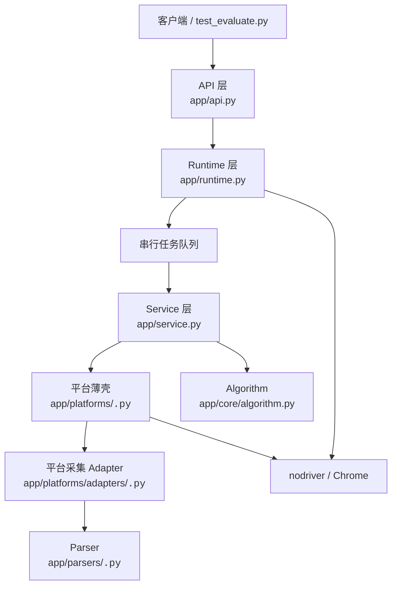
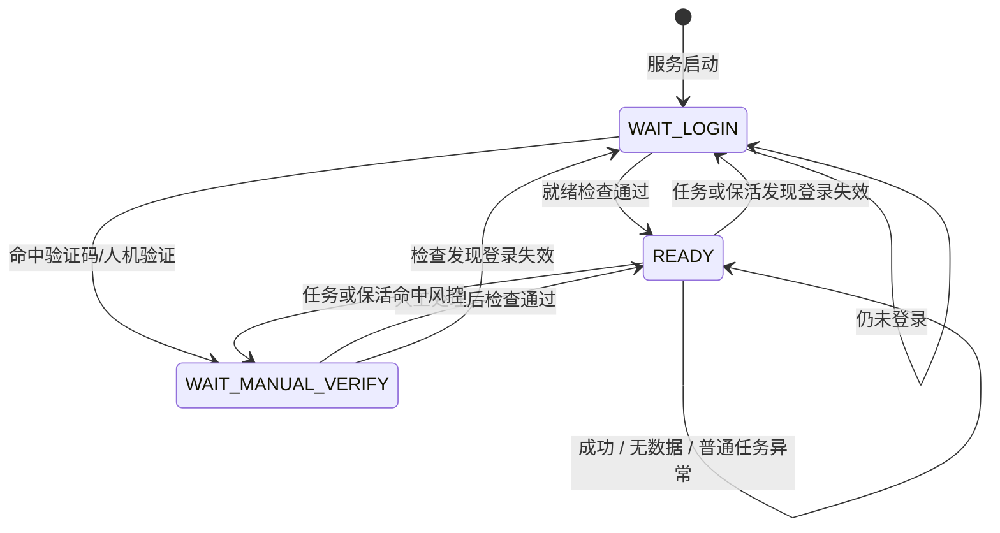
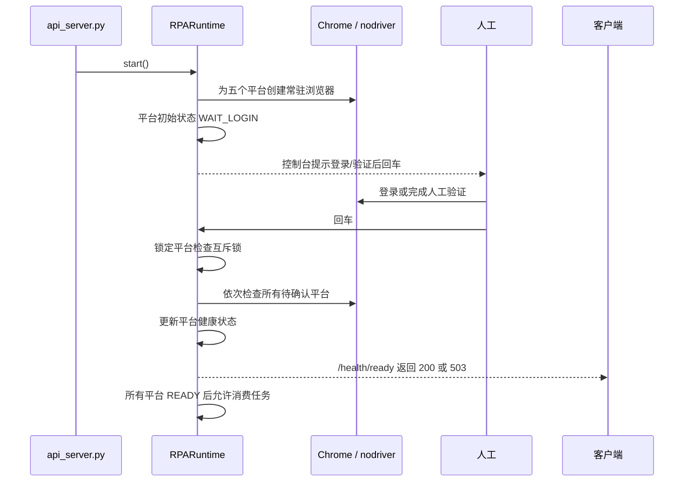

# -*- coding: utf-8 -*-

# 系统架构与运行时状态

## 1. 文档定位

本文是 `jeethink-rpa` 的运行时架构说明，重点描述模块边界、平台状态、任务状态、人工确认、保活和风控恢复之间的关系。

本文不定义房产价格算法，也不改变平台采集步骤。价格规则以 `app/core/algorithm.py` 为准，平台接入流程以[平台扩展对接文档](平台扩展对接文档.md)为准，接口字段以[API接口文档](API接口文档.md)为准。

## 2. 总体分层



### 2.1 各层职责

| 层 | 主要文件 | 职责 | 不负责的内容 |
|---|---|---|---|
| API | `app/api.py` | 接收请求、健康检查、状态查询、参数管理 | 浏览器操作、平台选择器 |
| Runtime | `app/runtime.py` | 浏览器生命周期、平台会话、状态机、任务队列、保活、恢复 | 页面 DOM 解析、价格决策 |
| Service | `app/service.py` | 串行调度平台、汇总平台结果、调用算法 | 平台专属选择器 |
| Platform | `app/platforms/` | 城市导航、平台流程委托、平台专属检测 | 修改核心算法 |
| Parser | `app/parsers/` | 从 HTML/结构化结果提取数据 | 浏览器控制、跨平台调度 |
| Algorithm | `app/core/algorithm.py` | 根据均价执行最终取值决策 | 网络 IO、平台风控 |

## 3. 核心运行时对象

### 3.1 `RPARuntime`

`RPARuntime` 是服务端唯一的运行时协调者，维护：

- 五个平台的浏览器实例和 `PlatformSession`。
- 平台健康状态 `platform_states`。
- 询价任务记录 `tasks` 和串行队列 `queue`。
- 当前执行任务 `current_task_id`。
- 保活、心跳、控制台人工确认三个后台协程。
- 平台检查互斥锁 `_platform_check_lock`。

### 3.2 `RPAInquiryService`

Service 每次接收一个 `InquiryRequest`，按平台逐一采集并汇总 `PlatformResult`。Runtime 负责等待平台就绪和保存任务状态，Service 负责本次询价的业务汇总。

## 4. 状态模型

状态分为四类，不能混用：

| 状态类别 | 定义位置 | 作用 |
|---|---|---|
| 服务状态 | `ServiceStatus` | 整个 RPA 服务能否接收任务 |
| 平台健康状态 | `PlatformHealthStatus` | 某个平台当前能否继续采集 |
| 平台结果状态 | `PlatformResultStatus` | 某次任务在某个平台的采集结果 |
| 任务状态 | `TaskStatus` | 某个询价任务的生命周期 |

定义集中在 `app/core/status.py`。

### 4.1 服务状态

```text
BOOTING       启动中
WAIT_LOGIN    存在未登录平台
READY         所有平台就绪
DEGRADED      存在人工验证或异常平台
STOPPING      停止中
```

### 4.2 平台健康状态

```text
INIT
WAIT_LOGIN
READY
WAIT_MANUAL_VERIFY
ERROR
```

平台健康状态是服务是否可以继续工作的依据。普通任务 `ERROR` 不应直接覆盖平台健康状态。

### 4.3 平台结果状态

```text
SUCCESS
NO_DATA
NO_MATCHING_AREA
WAIT_MANUAL_VERIFY
LOGIN_EXPIRED
ERROR
```

其中：

- `WAIT_MANUAL_VERIFY` 回写平台健康状态 `WAIT_MANUAL_VERIFY`。
- `LOGIN_EXPIRED` 回写平台健康状态 `WAIT_LOGIN`。
- `SUCCESS`、`NO_DATA`、`NO_MATCHING_AREA` 和普通 `ERROR` 只记录本次结果，不改变平台健康状态。

### 4.4 状态转换



`app/core/status.py` 中的 `PlatformHealthEvent` 是状态转换的唯一入口，Runtime 不应在业务代码中随意直接赋值改变状态。

## 5. 启动与人工确认链路



一次回车对应一个完整确认批次。人工确认期间，保活不得并发修改平台健康状态。

## 6. 并发与状态写入规则

### 6.1 平台检查互斥

`_platform_check_lock` 统一保护以下操作：

- API 或控制台触发的 `confirm_platform_ready()`。
- 控制台一次批量人工确认。
- 定时保活对平台状态的检查和回写。

`_manual_confirmation_active` 表示当前正在等待人工回车或执行确认批次。该标记存在时，保活循环跳过本轮，防止出现“保活先把平台改成 READY，人工确认随后跳过平台”的竞态。

### 6.2 任务结果版本保护

任务开始时记录每个平台的 `version`。任务结束回写结果时：

1. 如果任务期间平台状态没有变化，明确的 `LOGIN_EXPIRED` 或 `WAIT_MANUAL_VERIFY` 可以更新平台健康状态。
2. 如果任务期间已经发生人工确认、保活或其他状态变化，旧任务结果不得覆盖新状态。
3. 普通采集异常只写入任务结果，不把服务整体降级。

### 6.3 任务执行顺序

- 询价任务进入 `asyncio.Queue`。
- Worker 串行消费任务。
- Worker 等待所有平台为 `READY` 后才开始一次询价。
- 平台内部仍遵守既定搜索、面积筛选、分页、详情和解析顺序。

## 7. 询价链路


如果采集期间命中验证码或登录失效：

1. 平台返回 `WAIT_MANUAL_VERIFY` 或 `LOGIN_EXPIRED`。
2. Runtime 更新对应平台健康状态。
3. 客户端等待 `/health/ready` 恢复。
4. 当前评估记录由 `test_evaluate.py` 重新提交。

## 8. 风控职责边界

```text
平台 adapter
  └─ 平台专属 URL、HTML、登录态和验证码规则

app/platforms/base.py
  └─ 公共 URL/HTML 风控标识及统一恢复入口
```

- `detect_block_with_common()` 先执行平台专属检测，未命中时执行公共检测。
- `wait_and_reload_after_block()` 统一负责等待人工处理和重新取页面。
- 平台专属规则不能为了复用而挪入公共基类。
- 公共规则不能在五个平台 adapter 中重复维护。

## 9. 平台扩展边界

新增平台的正式落地文件：

```text
app/platforms/<code>_constants.py
app/parsers/<code>.py
app/platforms/adapters/<code>.py
app/platforms/<code>.py
```

同时注册：

- `app/platforms/__init__.py`
- `app/registry.py`

新平台应复用 Runtime、Service、Base 和 Algorithm，不得因平台接入改动核心任务流程或价格决策规则。

## 10. 排错入口

| 现象 | 首先检查 |
|---|---|
| 服务启动失败 | `api_server.py`、Chrome/nodriver 启动日志 |
| 回车后平台状态不一致 | `runtime.py` 的确认循环、保活日志、`/admin/status` |
| 验证码被识别为登录失效 | `base.py` 公共规则、平台 adapter 专属规则、`PlatformHealthEvent` |
| 任务异常但平台被降级 | `_apply_platform_results()` 和任务版本保护 |
| 平台有数据但返回无数据 | 小区匹配、面积筛选、`prepare_listing_data()` |
| 价格偏差异常 | `app/core/algorithm.py` 及平台结果明细 |

推荐检查接口：

```powershell
Invoke-WebRequest http://127.0.0.1:8000/admin/status -UseBasicParsing
Invoke-WebRequest http://127.0.0.1:8000/health/ready -UseBasicParsing
```

## 11. 相关文档

- [README.md](../README.md)：项目总览、运行方式和 API 使用示例
- [API接口文档.md](API接口文档.md)：接口、字段和状态码
- [平台扩展对接文档.md](平台扩展对接文档.md)：新平台 MVP 与正式接入流程
- [AGENTS.md](../AGENTS.md)：编码约束和不可擅改的业务流程
