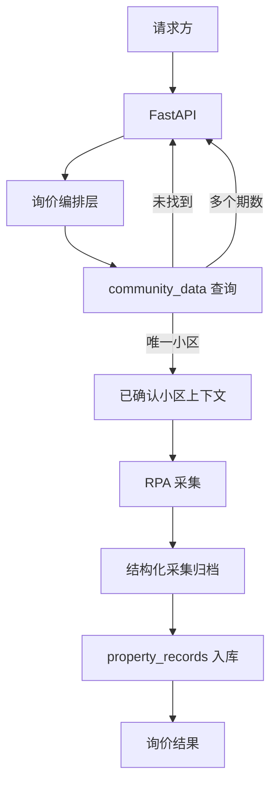

# RPA、小区与房源实时询价联动设计

> 状态：需求已确认，待实现。本文件只定义实时询价链路；现有模块文档中与当前代码一致的描述，在实现完成前不视为已变更。

## 1. 目标与范围

本期将请求方、FastAPI、`community_data`、RPA 和 `property_records` 串成一条可追溯的实时询价链路。小区身份由服务端确定，RPA 采集结果按该身份写入房源记录。

本期不包含自动更新、小区全量同步、未出现挂牌的逻辑删除，也不定义这些能力的触发方式。

## 2. 总体链路



请求方提交城市、行政区、小区名称、面积和可选请求标识。请求方不提交 `community_id`，也不直接调用 RPA 或房源记录模块。

## 3. 小区身份编排

### 3.1 查询结果分支

编排层调用 `community_data.resolve_communities(city, administrative_district, community_name)`，只按返回结果决定是否创建 RPA 任务：

| 查询结果 | FastAPI 行为 | 后续动作 |
|---|---|---|
| 0 条 | 返回小区未找到 | 不创建任务，不调用 RPA，不写房源记录 |
| 多条 | 返回可选期数信息 | 请求方提交明确期数后重新发起请求 |
| 1 条 | 构造已确认小区上下文 | 创建并执行 RPA 任务 |

不能按记录顺序、`community_group_id` 或默认“一期”自动选择期数。

### 3.2 已确认小区上下文

唯一小区进入 RPA 前，编排层构造并在任务生命周期内保存：

```text
community_id
community_group_id
city
administrative_district
canonical_name
aliases
phase
area
request_id
```

`community_id` 是 RPA 与 `property_records` 的唯一关联键。正式名和别名仅用于平台小区定位；它们不是房源关联键，也不能用来反向改绑已有房源。

RPA 不调用 `community_data`，不自行创建或选择小区。编排层将上下文传入 RPA，并在采集完成后以同一个 `community_id` 调用房源入库能力。

### 3.3 人工维护边界

正常请求中的 `resolve_communities()` 必须是纯查询：未命中时返回空结果，不创建小区，不调用地理编码。

小区新增、别名和期数维护、建成年份补充及地理编码只允许通过人工维护流程显式执行。现有 `CommunitySeed`、`insert_or_get()`、`add_seed()`、地理编码和维护脚本等底层能力继续保留和复用；仅从请求链路移除自动新增行为。

## 4. RPA 采集契约

### 4.1 平台定位

RPA 优先使用正式小区名进行平台定位；只有正式名无法定位时，才按已确认别名逐个回退。别名来自已确认的小区上下文，不接受请求方临时传入的别名。

搜索结果的归属校验仍只允许比较请求小区名与 `ListingSnapshot.community_name`。房源营销标题、整页 HTML 和搜索词均不得参与小区归属判断。

### 4.2 HTML 与解析

RPA 负责获取平台页面内容，parser 负责从 HTML 提取结构化字段。具体平台如何复用登录会话、页面操作或其他平台允许的方式获取页面内容，必须在该平台 MVP 中用真实 HTML 验证后确定，不在本设计中预设统一实现。

每个 parser 需要从房源 `<a href>` 解析单套房源详情地址，写入 `ListingSnapshot.listing_url`。解析结果至少包含：

```text
house_id（平台可提供时保留）
community_name
title
layout
area
total_price
unit_price
listing_url
```

各平台结果还可提供以下小区级地址：

| 字段 | 含义 | 本期用途 |
|---|---|---|
| `listing_page_url` | 小区挂牌销售列表入口 | 采集到时随结果保存，不主动使用 |
| `deal_page_url` | 小区成交列表入口 | 采集到时随结果保存，供成交数据关联 |
| `community_detail_url` | 小区详情页 | 仅初始化阶段辅助数据维护，不作为本期联动契约 |

`listing_page_url`、`deal_page_url` 与 `listing_url` 不能混用。`listing_url` 指向单套房源详情，是挂牌记录的唯一地址；小区级地址不能代替它。

## 5. 房源入库与归档

### 5.1 入库规则

编排层将每个平台的结构化结果交给 `PropertyRecordsIngestion`。挂牌记录以：

```text
source_platform + listing_url
```

作为外部唯一键。同一地址再次采集时更新原记录，不重复创建。无有效 `listing_url` 的房源不得伪造地址，应跳过入库并记录跳过原因。

实时询价只对本次采集到的挂牌执行 upsert，绝不调用“未出现即下架”的操作。成交记录只写入真实成交明细；平台为了估价兼容而提供的均价顶替值不能写入成交事实表。

采集时间作为 `seen_at` 传入，以保持较早采集结果不覆盖较新挂牌记录的保护。

### 5.2 结构化采集归档与重入库

每次 RPA 已获得平台结构化结果后、执行房源入库前，保存可重放的采集归档。归档至少包含：

```text
task_id
采集时间
已确认小区上下文
各平台状态和原因
挂牌快照及 listing_url
真实成交明细
小区级挂牌页和成交页地址
入库成功项、跳过项和错误信息
```

重入库只能读取既有归档并重新执行 `property_records` 写入，不重新触发 RPA。一次平台入库失败不回滚其他平台已经成功的幂等写入；归档保留失败原因，供修复后单独重放。

原始 HTML 是平台调试材料，不是重入库的必要输入；是否长期保留由各平台改造时按实际排障需要决定。

## 6. 职责边界

| 组件 | 负责 | 不负责 |
|---|---|---|
| FastAPI | 接收请求、返回未找到或期数待明确结果、创建任务 | 平台页面解析、直接写房源表 |
| 编排层 | 查询小区、构造上下文、连接 RPA 与入库、保存归档 | 平台专属页面操作、价格算法 |
| `community_data` | 查询人工维护的小区主数据 | 请求期间自动新增、浏览器操作、房源写入 |
| RPA | 平台定位、采集、HTML 解析、估价结果 | 创建或选择小区、直接依赖房源数据库 |
| `property_records` | 按 `community_id` 幂等保存挂牌和真实成交 | 小区解析、RPA 调度、最终估价 |

## 7. 实施顺序与重点验证

1. 将请求链路中的小区查询改为纯查询，保留人工新增能力。
2. 增加 FastAPI 编排层和已确认小区上下文，覆盖未找到、多个期数和唯一小区三种结果。
3. 逐平台以真实 HTML 验证房源 `<a href>` 解析，并补齐 `listing_url`。
4. 接入结构化归档和 `property_records` 幂等入库。
5. 仅保留下列重点测试：
   - 未知小区不新增记录、不创建 RPA 任务；
   - 多期小区不自动选择；
   - HTML 能解析有效 `listing_url`；
   - 同平台同 URL 重复采集更新同一挂牌记录；
   - 询价只增量更新，不触发逻辑删除；
   - 归档可在不调用 RPA 的情况下重入库。

实施代码前，平台 HTML 改造仍按平台逐项 MVP 验证；不得借本设计改变既有采集顺序、风控边界或估价算法。
